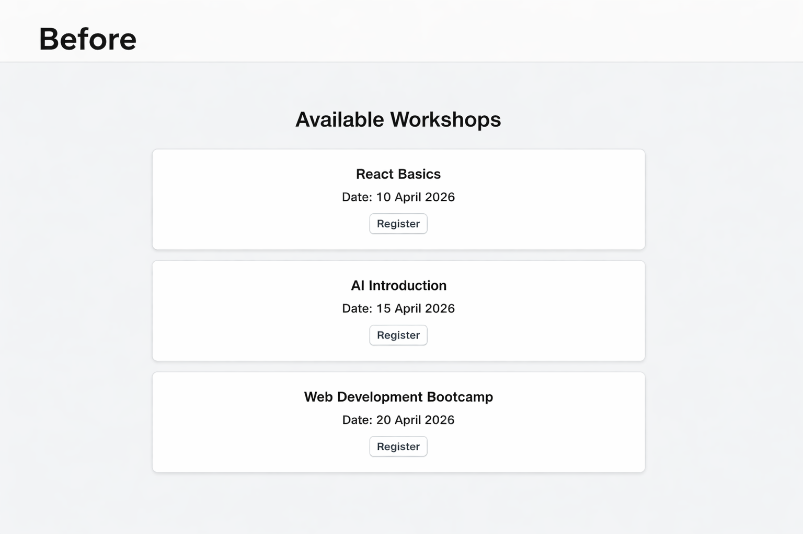
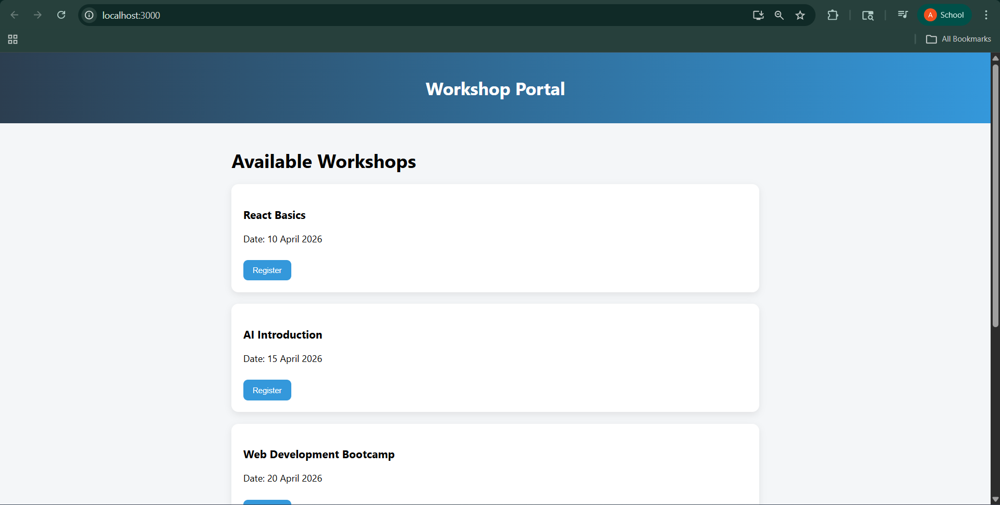
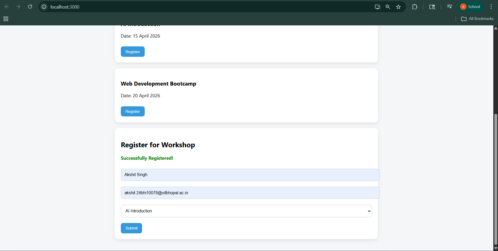

# Workshop Booking UI/UX Enhancement (React)

A modern, responsive redesign of the workshop booking interface focused on improving usability and user experience.

##  Overview

This project focuses on improving the user interface and user experience of the original workshop booking system. The goal was to make the platform more visually appealing, responsive, and easier to use, especially for students accessing it on mobile devices.
This project was developed as part of the FOSSEE UI/UX enhancement screening task.

---

##  Key Features

- Clean and modern UI
- Responsive design for mobile users
- Workshop cards layout
- Interactive registration form
- Success message after submission

---


##  Design Principles

The redesign was guided by the following principles:

* **Simplicity**: Removed clutter and kept the interface clean and minimal.
* **Consistency**: Used consistent colors, spacing, and button styles across the application.
* **Visual Hierarchy**: Important elements like headings and buttons are emphasized for better readability.
* **User-Centered Design**: Focused on how a student would interact with the system, making navigation intuitive.

---

##  Responsiveness

To ensure the application works well on all devices:

* Used a **mobile-first approach**
* Implemented **flexible layouts using CSS**
* Added **media queries** to adjust layout and font sizes
* Ensured buttons and inputs are easily clickable on small screens

---

##  Trade-offs

While improving the UI:

* Avoided heavy animations to maintain **fast load performance**
* Focused on **simple and clean design** instead of complex UI elements
* Did not integrate backend APIs to keep the focus on UI/UX improvements

---

##  Challenges Faced

* Understanding the structure of the existing project
* Designing a layout that works well on both desktop and mobile
* Balancing visual improvements with performance considerations

---

##  Improvements Made

* Added a clean **navbar**
* Introduced **card-based layout** for workshops
* Improved **form design and usability**
* Added **interactive registration flow**
* Replaced alert with **inline success message**
* Enhanced spacing, colors, and typography

---

##  screenshots

### Before


### After



---

##  Setup Instructions

```bash
git clone <your-repo-link>
cd workshop-ui
npm install
npm start
```
